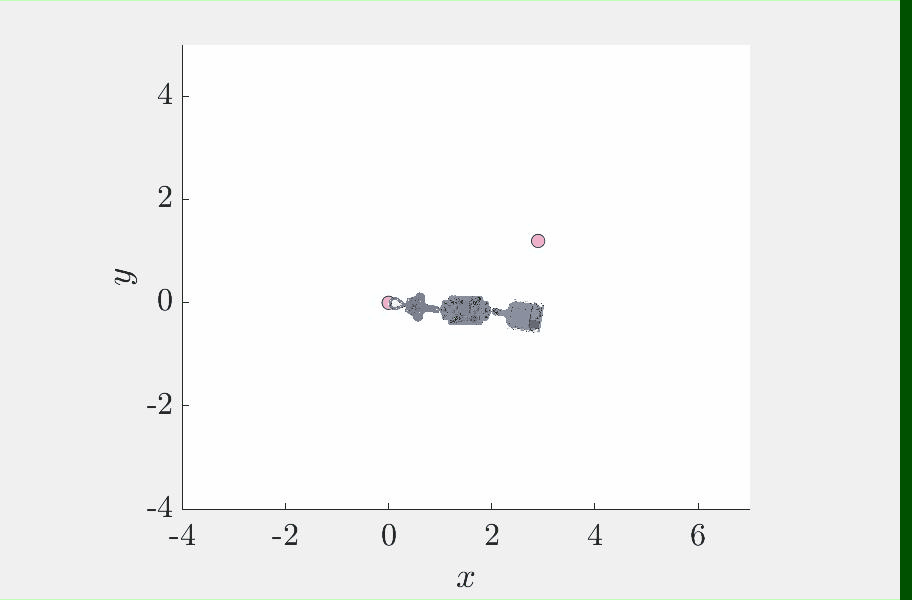

# Team Uneven Bars
## RDS 2020 Northwestern University

Hello! This is the group repo for the Uneven Bars team of RDS 2020.  We ended up sharing much of our code with each other, so you'll see some redundant examples throughout the directories.  Here is a list of how to run specific examples that were shown throughout our presentation. [Demo-Day Presentation](https://docs.google.com/presentation/d/1LsOqx8bDn7tv1ctSCxElXI1K3S5CPRHfwvgiGdfVRC0/edit?usp=sharing)

This is a simulation of the Clear-Hip Hecht, or going from low to high bar.  In order to run the code, open [Energy_Release_Catch](https://github.com/SegwayWarrior/Uneven_Bars_RDS/tree/master/Energy_Release_Catch) and run main_uneven_release.m in Matlab.

 In order to run the code, open [Energy_Pumping](https://github.com/SegwayWarrior/Uneven_Bars_RDS/tree/master/Energy_Pumping) and run main_uneven_pumping.m in Matlab.

## Future Plans
Moving forward, we plan on updating our simulation with the actual robot parameters, and produce a comprehensive comparison of the required torques for each controller (Energy, PID, and maybe Torque)
