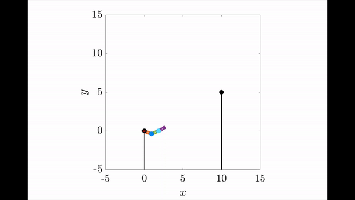

# Release and Catch another bar:
## Instruction:
1. The model contain three phase: release the bar, collision, and catch the bar. Release_bar model has five generalized variables: x, y, theta_1, theta_2 and theta_3. The initial parameters are stored in init_params_release.m. The initialize parameters is in line 60 to 70. The bar position is in line 77 to 84. This is a range variable in main_release.m, if the top position throw into the range, the robot is considered as catching the bar. Collision phase is named as collision.m. It used the q_dot_minus and M matix from releasing phase, A matrix is about constraint forces, it is derived from derive_equations2.m in triple_control folder. The q_dot_plus could be derived and give the inital value to next phase--catching the bar. The catch bar phase has only three generalized variables: theta_1, theta_2 and theta_3. 

2. run main.m. In main.m there is a success variable. If success = 1, the robot success catch another bar. You could watch the releasing.avi and catching.avi together. If success = 0, the robot did not catch another bar, just watch releasing.avi to see what happened.

 
3. derive_equations_releasebar.m is the m file constructing model. the generalized coordinates are in line 19. There are five variables: x_top y_top theta_1 theta_2 theta_3;

4. The example video is named as example_video.mp4. I did not figure out how to merge two videos in one file. So please watch the video releasing.avi and catching.avi seperately.

5. If you want to change the bar position or other paramters, please change the same code in init_params_release.m and init_params.m together. The names are the same

6. example with collision

