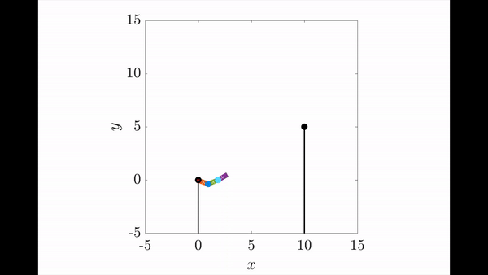

# Release and Catch another bar:
## Instruction:
1. run main.m. In main.m there is a success variable. If success = 1, the robot success catch another bar. You could watch the releasing.avi and catching.avi together. If success = 0, the robot did not catch another bar, just watch releasing.avi to see what happened.
2. The code is two states. The file name with _release is the function of releasing. If the robot is catching the bar. It will give the state of three theta and velocity to the init_params.m, which is the initial state after catching the bar.
3. The initial parameters are stored in init_params_release.m. The initialize parameters is in line 60 to 70. The bar position is in line 77 to 84.
4. derive_equations_releasebar.m is the m file constructing model. the generalized coordinates are in line 19. There are five variables: x_top y_top theta_1 theta_2 theta_3;
5. The example video is named as example_video.mp4. I did not figure out how to merge two videos in one file. So please watch the video releasing.avi and catching.avi seperately.
6. If you want to change the bar position, please change the same code in init_params_release.m and init_params.m together.

