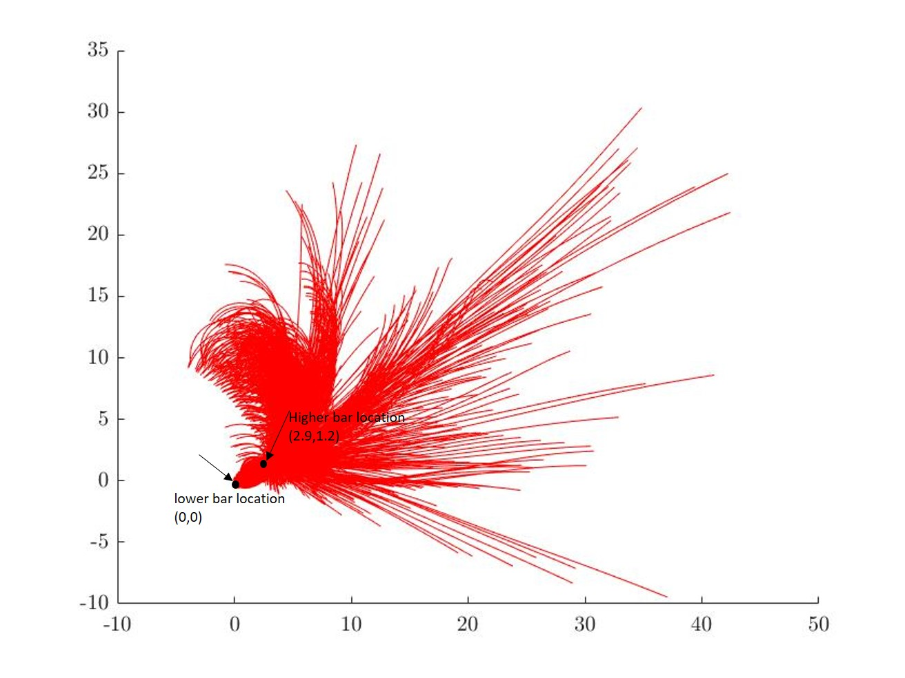

# select parameter
## Instruction:

1. The bar location is (2.9,1.2). It is derived by the real gymnaistic uneven bar location.
2. real_success_parameter.m uses a big loop to test all the possible combination of six value: theta_1, theta_2, theta_3, dtheta_1, dtheta_2, dtheta_3. The range and interval are not big for the calculating demonsion. 
3. success_parameter is used to select the success parameters. The parameter which are success to grab another bar is store in success_para.mat. Then the function draw a picture about all the trails which could grab the bar (2.9,1.2);
4. In my example, I test about 57000 combinations of value, and about 1800 are success to grab the bar.
5. The example picture is all the trials which could hit another bar location.

6. There are 1846 groups could hit the bar. I count the number and value of theta_1.
        Theta_1	   number	precent
      1.04 (pi/3)	35	    1.89%
      1.57 (pi/2)	1265	68.5%
      2.09 (2pi/3)	546	    29.5%
   Then I add a constraint of dtheta_1 <= 2 && dtheta_2 <= 2 && dtheta_3 <= 2 && theta_1 = pi/2
        Theta_2	   number	precent
           0	     10	    2.31%
        0.52(pi/6)	 153	35.41%
       1.04 (pi/3)	 208	48.14%
        1.57 (pi/2)	  61	14.12%
    The value of theta_1 = pi/2 and theta_2 = pi/6 is save as firstselectvalue.mat
    The value of theta_1 = pi/2 and theta_2 = pi/3 is save as secondselectvalue.mat 
